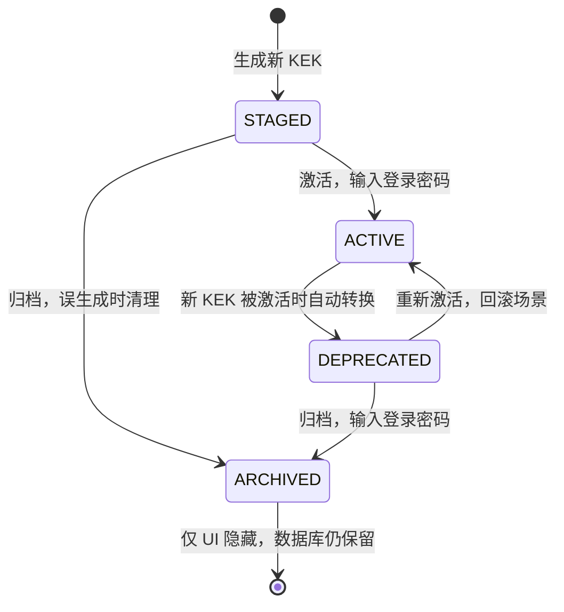
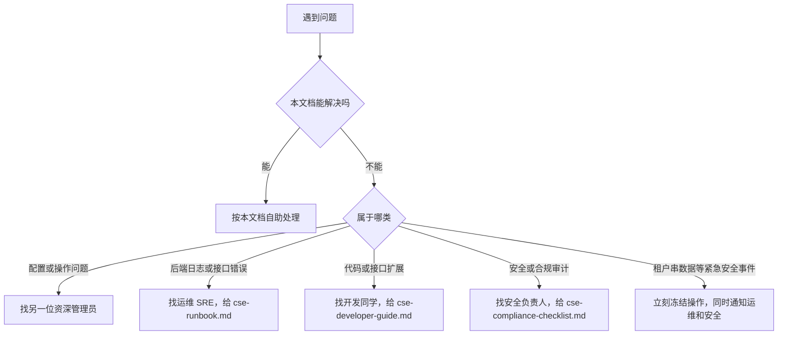

# CSE 文件加密 · 租户管理员使用指南

> 给第一次接触本系统加密功能的管理员看。
> 本文只讲"在页面上点哪里、出问题怎么自救"，不涉及任何命令行、配置文件或代码。
> 如果你是开发或运维角色，请直接看本目录下的 `cse-developer-guide.md` / `cse-runbook.md`。

---

## 1. 我能用它做什么？（30 秒理解）

CSE = **客户端加密（Client-Side Encryption）**。开启后：

- 用户上传的图片、附件，在**离开浏览器之前**就被加密成密文
- 服务器、对象存储里都只存**加密后的字节**，运维同事直接打开存储桶也看不到内容
- 只有"持有合法登录态或访客票据"的浏览器，才能在内存里把图片解出来显示
- 历史明文文件不会被改动；开关只影响**今后新上传**的文件

一句话总结：**开了之后，存储里裸奔的图片不再存在。**

---

## 2. 进入加密管理页面

**什么时候看这一节**：第一次找不到入口的时候。

操作步骤：

1. 用**超级管理员**账号登录后台
2. 左侧菜单进入「系统设置 → 文件加密管理」
3. 页面顶部能看到标题"**文件加密管理**"和两个 Tab：
   - **基础配置**：开关 + 加密路径白/黑名单 + 效果测试 + 保存
   - **密钥管理**：KEK 主密钥的生成、激活、归档、备份导出/导入、审计日志

<!-- TODO: 截图 - 文件加密管理页面整体 -->

> 没有看到这个菜单？说明你的账号没有 CSE 管理权限，找上一级管理员开通。

---

## 3. 第一次上线：3 步开通

**什么时候看这一节**：系统刚部署完，要把加密功能从"关"切换到"开"。

### 3.1 检查总开关

进入「**基础配置**」Tab，第一个卡片是"**CSE 总开关**"。

| 开关状态 | 含义 |
| --- | --- |
| **启用** | 上传请求会按下方白名单/黑名单决定是否走加密链路 |
| **关闭** | 全站新文件**全部明文上传**；历史 cse 文件仍可正常解密查看 |

如果是首次开通，把它切到「**启用**」。开关下方会出现一行说明文字，与上表完全一致——以页面文案为准。

### 3.2 勾选要加密的业务

往下看到第二个卡片"**加密业务（白名单）**"。表格里每一行就是一类业务路径（例如聊天附件、富文本嵌图、客服头像等）。

操作规则：

1. **整行可点**：点击行任意位置就会切换勾选状态
2. **带"系统强制"黄色标签的行不能取消**：这是产品出于安全考虑硬编码的最低保护范围（例如客服访客上传通道）
3. 勾选后该行会变蓝色高亮

第三个卡片是"**公开业务（黑名单）**"，规则相反——勾选了就**永不加密**。常见用途：品牌 LOGO、验证码图片这类本来就要让所有人看到的资源。

> **重要规则**：黑名单优先级**高于**白名单。同一个路径如果同时被勾在两边，会被互斥逻辑自动剔除一边。

### 3.3 保存（输入登录密码二次确认）

往下拉到底部"**保存配置**"卡片：

1. 点蓝色「**保存配置**」按钮
2. 弹出"保存 CSE 基础配置"对话框，里面会列出**总开关状态、白名单数量、黑名单数量**和具体路径预览
3. 在"**超管登录密码（二次确认）**"输入框里填**你当前账号的登录密码**
4. 点「**确定**」

> ⚠ 这里要的是你**登录系统的密码**，**不是**后面 KEK 备份的 zip 密码。两者完全无关，不要混用。

保存成功后会有提示"配置已保存，立即生效"。**60 秒内**全部后端节点会自动失效旧缓存，无需重启服务。

---

## 4. 看懂"加密白名单"和"公开黑名单"

**什么时候看这一节**：你看到表格里有"系统强制"标签、或者搞不清楚自己的勾选会不会生效时。

### 4.1 三层判定优先级

后端拿到一个上传请求时，会按下面顺序裁决：

| 顺序 | 判定 | 命中后的结果 |
| --- | --- | --- |
| 1 | 总开关是否关闭？ | 关 → 一律明文上传，下面都不看 |
| 2 | 命中黑名单？ | 中 → 明文上传 |
| 3 | 命中白名单？ | 中 → 加密上传 |
| 4 | 都没命中 | 默认按系统策略处理（一般是加密） |

### 4.2 "系统强制"行是什么

某些行的勾选框是**置灰不可点**，并且带一个**「系统强制」**的黄色锁标签。这表示这条路径是**产品代码里硬编码必须加密**的，例如：

- 客服访客通过 SDK 上传的图片（避免泄密给爬虫）
- 客服工作台直接发送的聊天附件

即使你"想"把它取消，UI 也不会让你做。这是有意为之的最低安全底线。

### 4.3 自定义路径（高级面板）什么时候用

页面中段有一个折叠面板「**高级设置：字典外的自定义路径（兜底）**」。

| 何时使用 | 何时**不要**使用 |
| --- | --- |
| 业务上线了一个全新的 bizPath，字典里还没收录 | 字典里**已经有**的路径——直接勾上面表格就行 |
| 临时给某个测试模块单独加密 | 给一个永久业务做加密——应该走代码字典，让开发同学补一行 |

输入格式：**以 `/` 结尾的路径前缀**，例如 `my-biz/`、`order-attach/`。逗号或空格分隔多条。

---

## 5. 用"效果测试"验证规则是否符合预期

**什么时候看这一节**：保存配置之前想先验证、或保存之后想确认某个具体业务到底会不会加密。

页面里有一张「**效果测试**」卡片：

1. 在输入框里填一个**业务路径**，例如 `airag`、`cs-visitor`、`avatar/cs-agent`
2. 选模式：
   - **当前生效配置**：用**已经保存到服务端**的规则测试
   - **待保存配置（含未提交修改）**：用你**正在编辑、还没点保存**的规则模拟
3. 点「**测试**」

返回结果会显示一个标签：

| 标签颜色 | 含义 |
| --- | --- |
| 绿色「**会加密（走 CSE 链路）**」 | 这个路径的上传会被加密 |
| 黄色「**不加密（明文上传）**」 | 这个路径的上传会保持明文 |

下方还会显示**命中的具体规则**（例如"匹配公开黑名单 `public/`"）和一段说明文字。

**典型用法**：保存配置前用「待保存配置」模式过一遍所有关键业务路径，确认无误再点保存。

---

## 6. KEK 主密钥日常管理

**什么时候看这一节**：你被告知要做密钥轮换、要做密钥备份、或者新接手系统想知道当前 KEK 健康度。

### 6.1 KEK 是什么（一段话）

KEK = **主密钥（Key Encryption Key）**。它是一把**永远不出后端**的密钥，用来"包裹"每个文件随机生成的小密钥（DEK）。**所有历史加密文件最终都依赖 KEK 才能解开**。所以：

> ⚠ **KEK 一旦丢失或损坏，所有历史加密文件无法挽回。**
> 上线后第一件事就是做一次「**导出加密备份**」并把备份文件 + 两套密码异地妥善保管。

### 6.2 4 种 KEK 状态对照表

进入「**密钥管理**」Tab，表格里每行是一把 KEK，有 4 种状态：

| 状态 | 含义 | 能否解密历史文件 | 是否用于加密新文件 |
| --- | --- | --- | --- |
| **ACTIVE** | 当前生效 | 是 | **是**（每个时点有且仅有一把 ACTIVE） |
| **STAGED** | 已生成但还没启用 | 否 | 否（等你点「激活」） |
| **DEPRECATED** | 旧版本，已被新 KEK 顶替 | 是 | 否 |
| **ARCHIVED** | UI 隐藏，但密钥本身仍在数据库 | 是 | 否 |

### 6.3 状态流转图

要点：

- **同时只能有一把 ACTIVE**。激活一把 STAGED 时，原本的 ACTIVE 会**自动**转 DEPRECATED——你不需要手动操作两次
- **DEPRECATED 不是死亡**。所有用旧 KEK 加密过的历史文件，仍然依赖它解密
- **ARCHIVED 也不删除密钥**。它只是把这一行从主表格里隐藏，密钥本体还在

### 6.4 季度轮换流程（推荐每 90 天做一次）

操作步骤：

1. 进入「**密钥管理**」Tab，点工具栏的「**生成新 KEK**」
2. 弹框里：
   - 「**备注**」：填一个能让半年后的你看懂的标记，例如 `2026Q1 季度轮换`
   - 「**超管登录密码**」：填**你当前账号的登录密码**（不是 zip 密码）
3. 点「**确定**」。新 KEK 出现在表格里，状态是 **STAGED**
4. **观察一段时间**（推荐至少 24 小时），确认期间没有异常告警
5. 在新 KEK 那一行点「**激活**」→ 再次输入**登录密码** → 「**确定**」
6. 刷新表格，应看到：
   - 新 KEK 状态变成 **ACTIVE**
   - 原来的 ACTIVE 自动变成 **DEPRECATED**
   - 此后所有新上传的文件都用新 KEK 加密

### 6.5 必做：导出加密备份（两套密码 + 妥善保管）

**这是上线后第一周必须完成的事。**

1. 在「密钥管理」Tab 工具栏点「**导出加密备份**」
2. 弹框里需要填**两套密码**——务必区分清楚：

| 密码字段 | 是什么 | 谁会用到 |
| --- | --- | --- |
| **备份压缩包密码（≥8 位）** | 你**临时设定**的一个高强度新密码，用来加密这个 zip | 将来恢复时再次输入 |
| **超管登录密码（二次确认）** | 你**当前账号的登录密码** | 仅用来验证你本人 |

3. 点「**确定**」，浏览器自动下载 `cse-kek-backup-<时间戳>.zip`
4. **保管要点**（这一步出错等于没备份）：
   - 把 zip 文件**至少存两份**：本地加密盘 + 异地（U 盘 / 公司密钥保管系统 / 离线介质）
   - 把"备份压缩包密码"**单独**记到密码管理器里（**不要**写在 zip 同一目录的 txt）
   - **不要**把这个密码用邮件、聊天工具明文发给任何人

> 备份内的 KEK 通过 PBKDF2 + AES-256-GCM 加密。即便 zip 落到外人手里，没有"备份压缩包密码"也解不开——但这并不意味着你可以放松保管。

### 6.6 从备份恢复

**什么时候用**：服务器迁移、数据库整体重建、KEK 表被误清空。

1. 在「密钥管理」Tab 工具栏点「**从备份恢复**」
2. 上传之前导出的 `.zip` 文件
3. 填两套密码：
   - 「**备份压缩包密码**」：导出时设的那个 zip 密码
   - 「**超管登录密码**」：你当前账号的登录密码
4. 点「**确定**」。提示"已导入 N 个 KEK"
5. 导入后所有 KEK 默认是 **STAGED** 状态。**根据需要手动激活其中一把**（通常是原 ACTIVE 那把）

> 注意：同名 kid 已存在时会**跳过**，不会覆盖。

### 6.7 千万不要做的 3 件事

| ❌ 不要 | 为什么 |
| --- | --- |
| 直接去数据库 `cse_kek` 表里 DELETE 一行 | 任何依赖这把 KEK 的历史文件**全部永久不可解** |
| 把同一把 KEK 多次"激活"以为可以"加固" | 系统会把上一把自动 DEPRECATED；如果你想回滚，请走"重新激活原 KEK"流程 |
| 把"备份压缩包密码"和 zip 文件放在同一个邮箱 / 同一台机器 | 等于没加密。任何能拿到 zip 的人也能同时拿到密码 |

---

## 7. 上线后第一周：自检清单

**什么时候看这一节**：刚切到生产环境，想确认配置没问题。

逐条做完：

| # | 动作 | 预期结果 |
| --- | --- | --- |
| 1 | 进「文件加密管理 → 基础配置」，确认总开关是「**启用**」 | 出现绿色"已启用"文案 |
| 2 | 在「效果测试」里输入 `airag` 和 `cs-visitor`，模式选「当前生效配置」 | 都返回**绿色"会加密"** |
| 3 | 在「效果测试」里输入业务侧明确不该加密的路径（例如 `public`） | 返回**黄色"不加密"** |
| 4 | 进「密钥管理」Tab，确认表格里**有且仅有一把 ACTIVE** | 状态列只有一个绿色 ACTIVE 标签 |
| 5 | 完成 6.5 节"导出加密备份"，把 zip 和密码异地保管 | 下载到 `cse-kek-backup-*.zip`，并已转存 |

任何一条不符合预期，先按第 8 节自诊；自诊解决不了就按第 10 节升级。

---

## 8. 常见故障自诊

**什么时候看这一节**：用户来反馈问题、或者你自己测试时遇到异常。

### 8.1 客服或访客反馈"图片显示不出来 / 一直转圈"

**先排查（你能做的）**：

1. 进「文件加密管理 → 基础配置」，确认总开关是「**启用**」
2. 在「效果测试」里输入对应业务的 bizPath，确认它"**会加密**"
3. 让用户**完全退出登录再重新登入一次**（这会清空浏览器里的密钥缓存）
4. 让用户在浏览器里**强制刷新**（Ctrl + F5）一次

**何时升级到运维**：以上都做了，问题仍在 → 找运维同事按 `cse-runbook.md` 第 8 节排查 `/sys/secure/file/{fid}` 接口状态。

### 8.2 头像永远破图

**先排查**：

1. 在「基础配置」表格里找到 `avatar/` 行，确认它**没被勾在公开黑名单里**
2. 在「密钥管理」Tab 看是否有 ACTIVE 状态的 KEK（没有就是密钥没初始化）

**自助修复**：如果上一步发现没有 ACTIVE KEK，按 6.4 节激活其中一把 STAGED；如果连 STAGED 都没有，先生成再激活。

**何时升级**：表格里有 ACTIVE KEK 但头像仍破 → 找运维。

### 8.3 上传成功但立即看不到

**最可能原因**：浏览器拿到了密文但还在解密中。

**先排查**：等 1-2 秒再刷新；如果稳定复现且超过 10 秒，找运维查看后端日志。

### 8.4 切换租户后看到不该看到的图

**这是高优先级安全问题，立刻做**：

1. **不要继续操作**，截屏保留证据
2. 立即联系运维**按 `cse-runbook.md` 第 8 节末行排查租户隔离**
3. 在排查清楚之前，建议临时把总开关切回「关闭」并不再上传敏感文件

### 8.5 保存配置时提示"密码错误"

**99% 的原因**：填错了密码字段。

| 字段 | 应该填的内容 |
| --- | --- |
| 「超管登录密码（二次确认）」 | 你**登录这个后台的密码**——和你刚才登录用的那一串一样 |
| **不是** | KEK 备份压缩包密码、对象存储密钥、数据库密码 |

如果确认密码正确仍然报错 → 找运维查后端审计日志。

### 8.6 KEK 列表是空的

**这种情况只在两种场景出现**：

1. 系统第一次启动，但还没有任何 KEK 写入（极罕见，正常情况下首次启动会自动生成 `k1`）
2. 数据库 `cse_kek` 表被人**误清空**

**自助修复**：如果你有备份 zip，按 6.6 节"从备份恢复"。**如果没有备份**，所有历史加密文件**已无法挽回**——必须升级到运维 + 安全负责人。

---

## 9. 名词速查表

| 术语 | 含义 | 你大概什么时候会看到它 |
| --- | --- | --- |
| **CSE** | 客户端加密（Client-Side Encryption），本系统采用的加密方案 | 菜单名"文件加密管理"对应的英文缩写 |
| **KEK** | 主密钥（Key Encryption Key），永远不出后端 | 「密钥管理」Tab 全程都在管它 |
| **DEK** | 文件密钥（Data Encryption Key），每个文件随机生成一把，用 KEK 包装后落库 | 一般你看不到，运维排查时才提 |
| **kid** | KEK 的版本号（如 `k1`、`k2`） | KEK 表格第一列 |
| **fid** | 加密文件的 24 位短 ID | 出现在 `cse://` URL 里 |
| **`cse://{fid}`** | 加密文件的内部引用形式，前端会自动解密渲染 | 数据库 `oss_file.url` 字段、HTML 富文本里 |
| **bizPath** | 业务路径前缀（如 `airag/`、`avatar/`），决定走加密还是明文 | 「基础配置」表格里"业务路径"列 |
| **STAGED / ACTIVE / DEPRECATED / ARCHIVED** | KEK 的 4 种生命周期状态，见 6.2 节 | 「密钥管理」表格状态列 |
| **审计日志** | 谁在什么时间对哪把 KEK 做了什么操作 | 「密钥管理」Tab 下半部分表格 |

---

## 10. 我应该找谁？（升级路径）

**配套文档**（同 docs/ 目录下，按需取用）：

- [`cse-developer-guide.md`](cse-developer-guide.md)：给开发者，讲加密协议、API、扩展点
- [`cse-runbook.md`](cse-runbook.md)：给运维 / SRE，讲命令行、监控指标、灰度发布、应急回滚
- [`cse-compliance-checklist.md`](cse-compliance-checklist.md)：给安全 / 合规审查

**最后提醒**：

> 上线之后请**至少**完成两件事：
>
> 1. 第 7 节自检清单全部走一遍
> 2. 第 6.5 节"导出加密备份"做完，并把 zip 和密码**异地分开**保管
>
> 这两件事任何一件没做，都不能算"加密功能上线完毕"。
